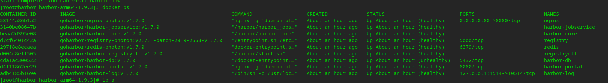
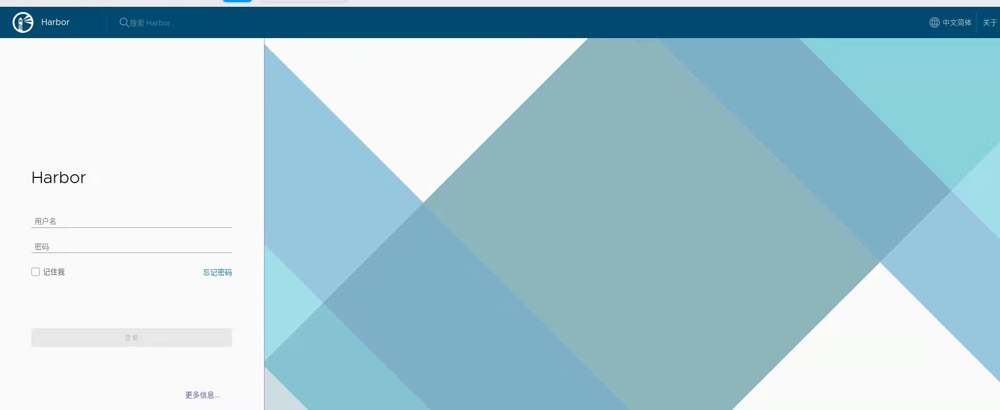
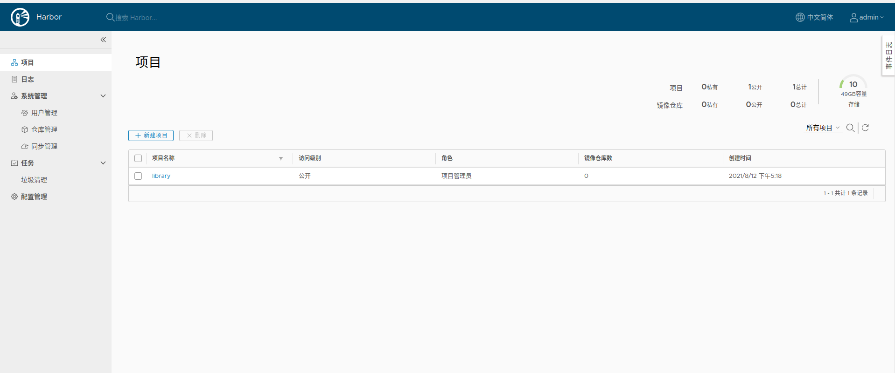

# Harbor-1.9.3源码编译指导

## 编译环境配置

- 安装编译依赖

  ```bash 
  yum install autoconf automake npm nodejs docker-engine git golang -y
  yum install docker-compose java-1.8.0-openjdk-devel maven vim patch -y
  ```

- 设置环境变量

  - 打开环境变量配置文件

  ```bash
  vim /etc/profile
  ```

  - 在文件末尾添加如下所示内容

  ```bash
  #JAVA
  export JAVA_HOME=/usr/lib/jvm/java-1.8.0-openjdk
  export PATH=$JAVA_HOME/bin:$PATH
  export CLASSPATH=.:$JAVA_HOME/jre/lib:$JAVA_HOME/lib:$JAVA_HOME/lib/tools.jar
  
  #GO
  export GOROOT=/usr/lib/golang
  export GOBIN=/usr/lib/golang/bin/
  export GOPATH=/data/harbor
  export GOOS=linux
  export GOARCH=arm64
  export PATH=$PATH:$GOROOT:$GOBIN
  ```

  - 加载环境变量使配置生效

  ```bash
  source /etc/profile
  ```
- 修改 hosts

  ```bash
  vim /etc/hosts
  ```

  - 在文件中添加如下所示内容

  ```bash
  140.82.112.3 github.com
  185.199.108.133 raw.githubusercontent.com
  140.82.114.9 codeload.github.com
  ```

- 配置 docker 代理

  - 打开 docker 配置文件，不存在则创建

  ```bash
  vim /etc/docker/daemon.json
  ```

  - 在文件中添加如下所示内容

  ```bash
  {
    "registry-mirrors": [
        "https://docker.mirrors.ustc.edu.cn",
        "https://registry.docker-cn.com"
    ]
  }
  ```

  - 重启 docker 服务

  ```bash
  systemctl restart docker
  ```

- 关闭防火墙

  ```bash
  systemctl stop firewalld
  ```

## 编译 Harbor-1.9.3

- 下载 Harbor 源码包并解压

  - 创建编译目录并进入

  ```bash
  mkdir -p /data/harbor && cd /data/harbor
  ```

  - 获取源码并解压源码包

  ```bash
  wget https://github.com/hzliangbin/harbor-arm64/archive/refs/tags/v1.9.3.tar.gz
  tar -xzf v1.9.3.tar.gz
  cd harbor-arm64-1.9.3/
  ```

- 配置 Harbor 

  - 修改配置文件存放目录权限

  ```bash
  chmod 0777 make/common
  ```

  - 修改 hostname 为编译机器的IP

  ```bash
  vim make/harbor.yml
  hostname：xx.xx.xx.xx
  ```

  - 打入补丁修改 Dockerfile 文件，解决编译时的权限问题，补丁已上传仓库

  ```bash
  patch -p1 < fix-primission-denied-error.patch
  ```

- 开始编译

若出现因网络问题导致的编译失败，重新编译即可

  ```bash
  make install 
  ```

- 编译成功的 Harbor 相关镜像显示如下



- 打开浏览器访问编译机器 https://ip ，访问成功显示如下



- 输入初始账号和密码 admin / Harbor12345，登录成功如下所示


